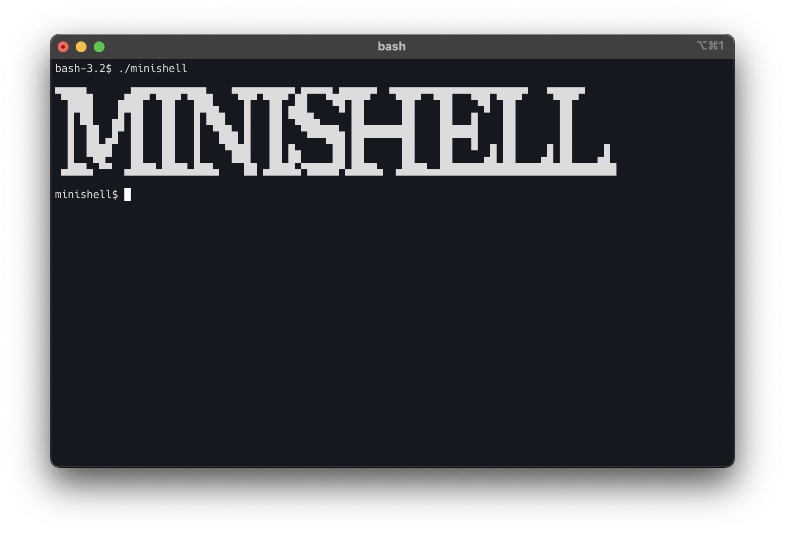

*This project has been created as part of the 42 curriculum by tafujise and fendo*
# minishell



## Description

This project is about building a simple shell in C.

The goal is to handle command execution, redirections, pipelines, environment expansion, and built-in commands while understanding the basics of Unix shell behavior.

## Instructions
```bash
make
./minishell
```

## Features

- Built-in commands: `echo`, `cd`, `pwd`, `export`, `unset`, `env`, `exit`
- Operators: `|`, `&&`, `||`, `(`, `)`
- Redirections: `<`, `>`, `<<`, `>>`
- Environment variable expansion
- Interactive input with `readline`

## Resources
### Core Concepts
- **Bash Reference Manual**  
  https://www.gnu.org/software/bash/manual/bash.html

- **POSIX Shell Command Language**  
  https://pubs.opengroup.org/onlinepubs/9699919799/utilities/V3_chap02.html

## Use of AI
AI tools were used for research.
