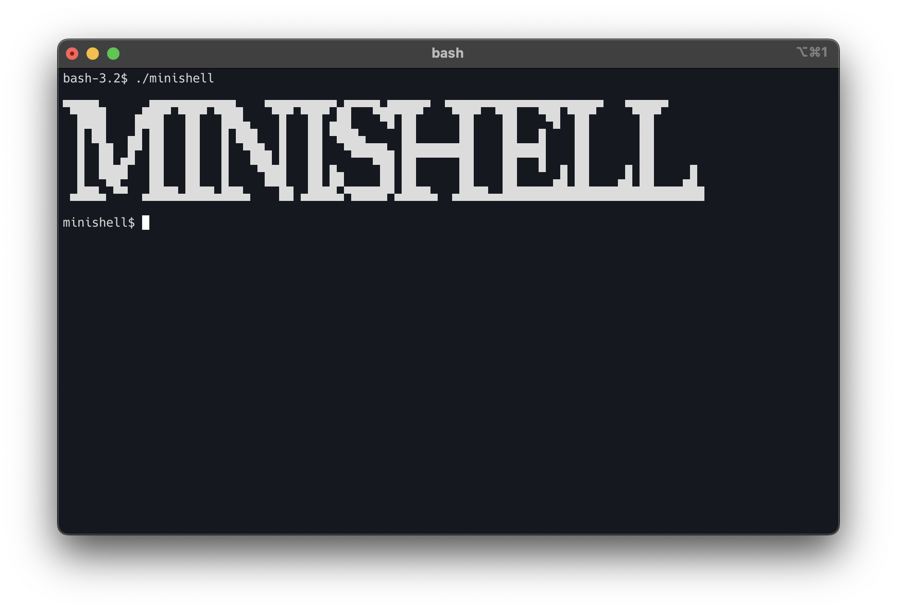

*This project has been created as part of the 42 curriculum by tafujise, fendo.*

# minishell



## Description

minishell is a small POSIX-style command interpreter written in C, built as part
of the 42 curriculum. The goal is to reproduce the part of `bash` a person
actually types at a prompt, and in doing so to learn how a shell turns a line of
text into processes: how words are split and quoted, how variables are expanded,
how file descriptors are wired between commands, and how signals reach a
foreground job.

It reads a line, turns it into a syntax tree, expands the words in it, and runs
the result — builtins inside the shell, everything else through `fork` and
`execve`. It supports quoting, environment expansion, the four redirections
including here-documents, pipelines, and the bonus operators `&&`, `||` and
parentheses, plus `*` wildcards in the working directory.

Where the subject is silent, `bash` is the reference: behaviour was checked
against it case by case, and the differences that remain are deliberate and
listed under [Notes on behaviour](#notes-on-behaviour).

## Instructions

Requires a C compiler, `make`, and the GNU **readline** library with its headers
(`libreadline-dev` on Debian/Ubuntu, `brew install readline` on macOS — the
Makefile picks up the Homebrew prefix on its own).

```bash
make          # build ./minishell
./minishell   # start it
```

Other rules: `clean`, `fclean`, `re`, and `debug` (builds with `-g -O0`).

```
minishell$ echo hello | tr a-z A-Z
HELLO
minishell$ export NAME=world
minishell$ echo "hi $NAME" > out.txt && cat out.txt
hi world
minishell$ cat << EOF
> $NAME
> EOF
world
minishell$ exit
```

## Features

- **Builtins**: `echo` (with `-n`), `cd`, `pwd`, `export`, `unset`, `env`, `exit`
- **Redirections**: `<`, `>`, `>>`, and `<<` here-documents
- **Pipelines**: `|`, any number of stages
- **Quoting**: `'…'` protects everything, `"…"` protects everything but `$`
- **Expansion**: `$VAR` and `$?`, with field splitting on `IFS`
- **Signals**: `ctrl-C`, `ctrl-D` and `ctrl-\` behave as they do in `bash`
- **History**: provided by readline, navigable with the arrow keys
- **Bonus**: `&&`, `||`, parentheses for grouping, and `*` wildcards

## How it works

One line of input passes through four stages. Each stage owns a directory, so
the place to look for any behaviour is the stage that decides it.

| Stage | Directory | What it produces |
|---|---|---|
| **Lexer** | [src/lexer/](src/lexer/) | Tokens. A word is kept as a chain of parts, one per quoting context, so `a"b"c` stays one word while remembering which piece was quoted. |
| **Parser** | [src/parser/](src/parser/) | A syntax tree, following the grammar in [grammar_ebnf.md](grammar_ebnf.md). Here-document bodies are collected here, unexpanded. |
| **Expander** | [src/expand/](src/expand/) | Final argument lists. Parameter expansion, then field splitting, then wildcards — each suppressed where quoting says it should be. |
| **Executor** | [src/execute/](src/execute/) | Processes. Builtins run in the shell, external commands through `fork` + `execve`, with redirections applied per command and undone after. |

Supporting code: [src/builtin/](src/builtin/) for the seven builtins,
[src/hashmap/](src/hashmap/) for the environment table,
[src/signal/](src/signal/) for the handlers, and [src/strutil/](src/strutil/)
for the growable buffer and the error messages.

Two decisions worth knowing before reading the code:

- **The shell never uses `stdio` for its own output.** Everything goes through
  `write_all()` in [src/strutil/msg.c](src/strutil/msg.c). A buffer that
  survives a `fork`, or a restored redirection, would otherwise write to the
  wrong place.
- **The tree and the words live in arenas**, reset once per command line
  ([libft/ft_arena_*.c](libft/)). Nothing in the tree is freed one node at a
  time, which is why the parser can fail anywhere without leaking.

Only one global exists, as the subject demands: `g_signum` in
[src/signal/signal_handle.c](src/signal/signal_handle.c). It is a
`volatile sig_atomic_t` holding a signal number and nothing else; the handler's
whole body is one assignment.

## Testing

```bash
sh test/diff_test/run.sh      # run ~80 cases against bash and compare
norminette src include libft  # style
```

`test/diff_test/run.sh` runs each case in its own empty directory under both
minishell and `bash`, and compares standard output, exit status, and the files
left behind. A case that is known to differ is listed in `EXPECTED_FAIL` and
reported as `XFAIL`.

## Checking for memory leaks

The subject exempts readline: *"The readline() function may cause memory leaks,
but you are not required to fix them. However, this does not mean your own code,
yes the code you wrote, can have memory leaks."* readline keeps its line buffer,
its history and its terminal description until the process ends, so those blocks
are still reachable at exit and would otherwise bury the interesting output.

[readline.supp](readline.supp) suppresses exactly those and nothing else — every
stanza requires a frame inside `libreadline`, `libhistory` or `libtinfo`, so a
block that only passed through minishell's own code is still reported:

```bash
valgrind --leak-check=full --show-leak-kinds=all \
         --suppressions=readline.supp ./minishell
```

The shell process then reports zero in every category:

```
definitely lost: 0 bytes in 0 blocks
indirectly lost: 0 bytes in 0 blocks
  possibly lost: 0 bytes in 0 blocks
 still reachable: 0 bytes in 0 blocks
      suppressed: 198,668 bytes in 212 blocks
```

**A second summary after a subshell or a builtin in a pipeline is expected.**
Those are the only children that leave without `execve`, and valgrind follows
them. What they report — around 11 KB — is the parent's memory, inherited
through `fork`: the environment table, the arenas, readline's buffers. A child
that is about to `_exit` does not free a copy nobody will read again. `bash`
does the same, and more of it: under the same session `bash` leaves 53,677 bytes
still reachable in the shell and 53,718 in the forked child, against 0 and
11,361 here.

## Notes on behaviour

These differences from `bash` are deliberate. The subject says *"You should
limit yourself to the subject description. Anything that is not asked is not
required."*

- **`\` and `;` are not interpreted.** The subject asks for this in as many
  words, so `echo a\ b` prints `a\ b`.
- **Unclosed quotes are a syntax error** rather than a continuation prompt; the
  subject says they need not be interpreted.
- **Not implemented, because they are not in the subject**: `~`, `$'…'` and
  `$"…"`, `${…}`, `$$` and positional parameters, `cd -`, and the `>|`, `<>`
  and `<<<` redirections. Each is either a syntax error or left uninterpreted:
  `${x}` prints itself, `cd -` looks for a directory named `-`, and `<<<` is
  rejected as an unexpected token.
- **A syntax error does not abort the rest of the input.** The shell reports it
  and reads the next line, as it does at an interactive prompt. Non-interactive
  `bash` abandons the whole script instead.
- **`env` and `export` list in their own order.** `export` sorts, as `bash`
  does; `env` prints in hash-table order, which the subject does not constrain.

## Resources

### Core concepts

- **Bash Reference Manual** — https://www.gnu.org/software/bash/manual/bash.html
- **POSIX Shell Command Language** — https://pubs.opengroup.org/onlinepubs/9699919799/utilities/V3_chap02.html
- **GNU Readline Library** — https://tiswww.case.edu/php/chet/readline/rltop.html
- The sources of `bash` and `dash`, read for the questions the manual leaves
  open: where a status comes from when a signal ends a command, and what a shell
  does when a line asks for more here-documents than it holds.

### Use of AI

AI was used as a research and review assistant, not as an author of the design.
Specifically:

- **Research.** Clarifying POSIX and `bash` behaviour in the corners the manuals
  state briefly — quoting and field splitting, expansion order, and the exit
  status a signalled command produces.
- **Review.** Reading finished branches for defects, and cross-checking the
  lexer, parser and expander specifications against each other for
  contradictions before they were implemented. The findings were reviewed by
  hand and applied by us.
- **Verification.** Running the implementation against `bash` over large sets of
  generated cases, and helping interpret `valgrind` and `scan-build` output.
  Several defects were found this way — a saved file descriptor that could land
  on `stderr`, a here-document delimiter whose quoting was only checked on its
  first part, and a here-document temporary file that could not be created in a
  read-only directory — and the regression cases that guard them are in
  `test/diff_test/run.sh`.

Commits that were written with that assistance carry a `Co-Authored-By` trailer,
so `git log` shows exactly which ones. The architecture, the grammar, and the
implementation are ours, and we can explain any part of them.
